# Student Grade Checker & Management System (C++ & PEP)

<div align="center">
  <h3>📸 Project Previews</h3>
  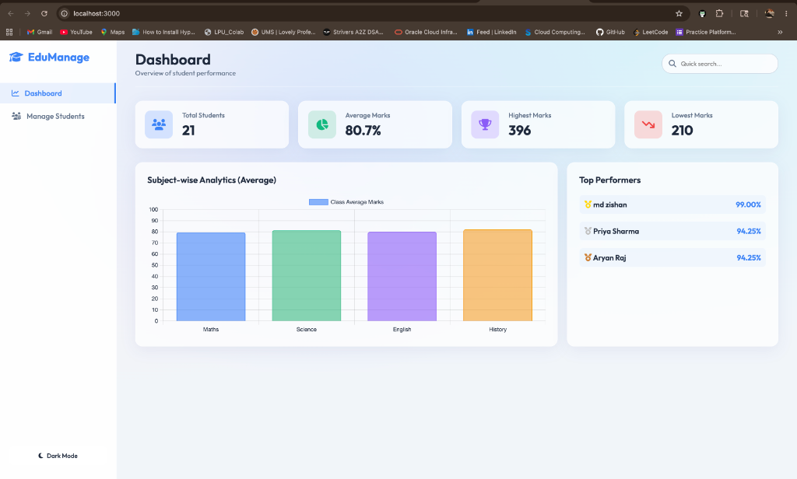
  <br/>
  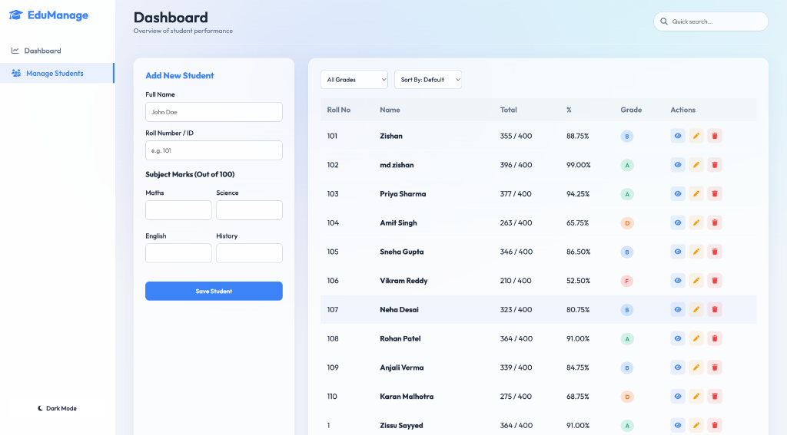
  <br/>
  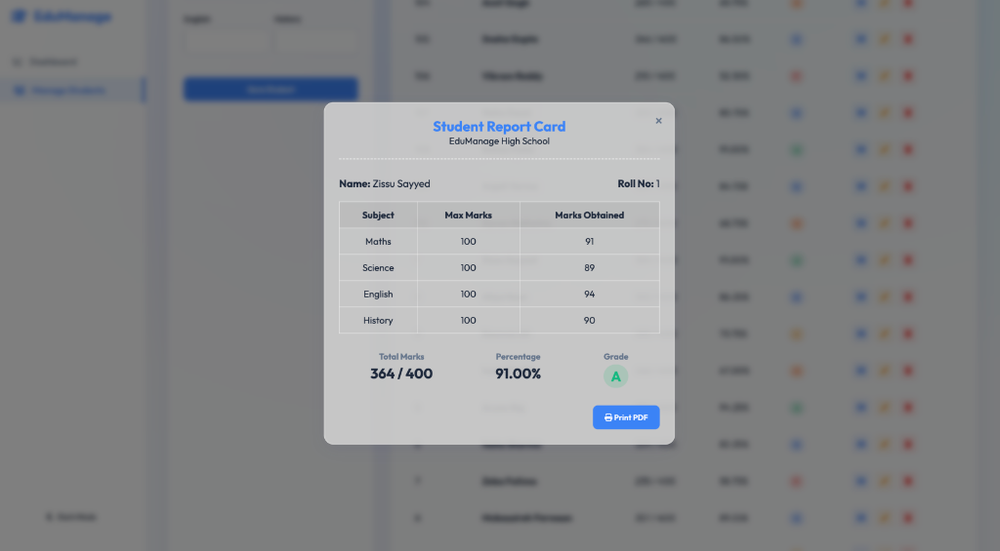
  <br/>
  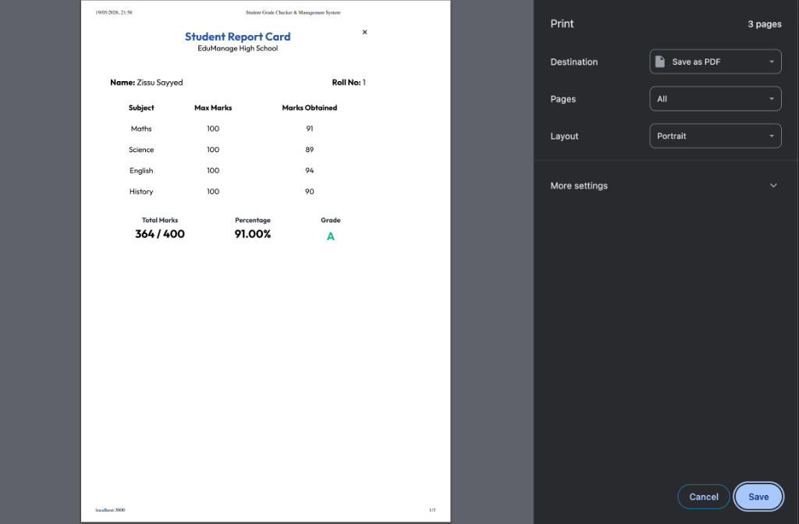
</div>

A hybrid full-stack **Student Grade Checker and Management System** that combines the raw performance of a **C++ backend** with a beautiful, modern **Glassmorphism Web Dashboard** via a **Node.js bridge**.

## 🚀 Features

### Core Capabilities
- **CRUD Operations:** Easily Add, View, Update, and Delete student records.
- **Automatic Calculations:** Automatically computes Total Marks, Percentage, and assigns a Grade (A, B, C, D, F) based on weighted averages/course policies.
- **Persistent Storage:** Data is stored persistently in a local database file (`students_db.dat`) ensuring records are not lost between sessions.
- **Hybrid Architecture:** Uses a Node.js REST API to execute and communicate with a compiled C++ binary, bringing low-level data structures to a modern Web UI.

### Advanced Data Structures & Algorithms
- **Efficient Lookup (BST):** Uses a Binary Search Tree (acting like a tree/hash-table lookup) to store and retrieve student data efficiently in `O(log n)` time complexity.
- **Merge Sort:** Implements Merge Sort to sort student records alphabetically by Name.
- **Quick Sort:** Implements Quick Sort to sort student records in descending order based on their Grades/Percentage.
- **Aggregate Statistics:** Calculates class average percentage, highest grade, and lowest grade in real-time.

### Beautiful UI & UX
- **Glassmorphism Design:** A modern, frosted-glass interface that feels premium and responsive.
- **Interactive Terminal:** For CLI lovers, the C++ backend provides a fully functional interactive terminal menu if run directly.

## 🛠️ Tech Stack & Languages Used

- **C++ (Backend):** Handles all the heavy lifting, data structures (BST), sorting algorithms, calculations, and file I/O operations.
- **Node.js & Express.js (Middleware/Bridge):** Acts as a REST API server that bridges the frontend and the C++ binary.
- **HTML5 & CSS3 (Vanilla):** Structures the page and applies the stunning glassmorphism styling, animations, and responsive layout.
- **JavaScript (Vanilla Frontend):** Handles DOM manipulation, asynchronous API fetching, and dynamic UI updates.

## ⚙️ How It Works

1. **The Frontend** (HTML/CSS/JS) sends a REST API request (GET, POST, DELETE) to the Node server.
2. **The Node Server** (`server.js`) intercepts the request and uses `child_process` to execute the compiled C++ binary (`backend`) with specific command-line arguments.
3. **The C++ Backend** (`student_backend.cpp`) parses the arguments, performs the requested algorithmic operations (using BSTs, File I/O, Sorting), and outputs a JSON-formatted string.
4. **The Node Server** captures the JSON string and sends it back to the Frontend to render on the dashboard.

## 🏃‍♂️ How to Run Locally

### Prerequisites
- Node.js installed
- A C++ Compiler (like `g++` or `clang++`)

### 1. Compile the C++ Backend
First, compile the backend script to create the executable binary.
```bash
g++ student_backend.cpp -o backend
```

### 2. Install Node Dependencies
Install the required packages for the Node.js server.
```bash
npm install
```

### 3. Start the Application
Start the Node server. This will also serve the static frontend files.
```bash
npm run start 
# OR
node server.js
```

### 4. Open the Web Dashboard
Open your web browser and navigate to:
```
http://localhost:3000
```

---

### Using the Interactive Terminal (Optional)
If you prefer to use the pure C++ backend without the web UI, you can run it interactively in your terminal:
```bash
./backend
```
*This will open the CLI menu where you can insert students, sort by names/grades, view statistics, and search for specific records.*

#### Terminal CLI Previews
<div align="center">
  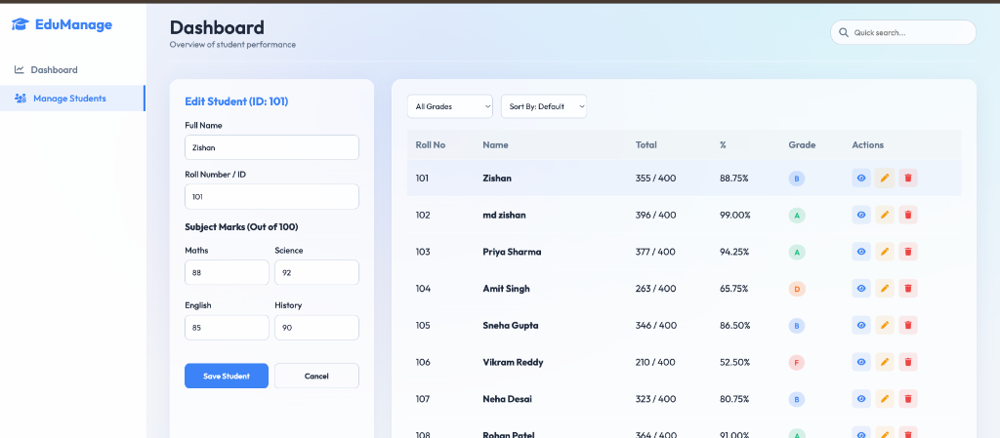
  <br/>
  <b>Choice 1: Insert new student</b><br/>
  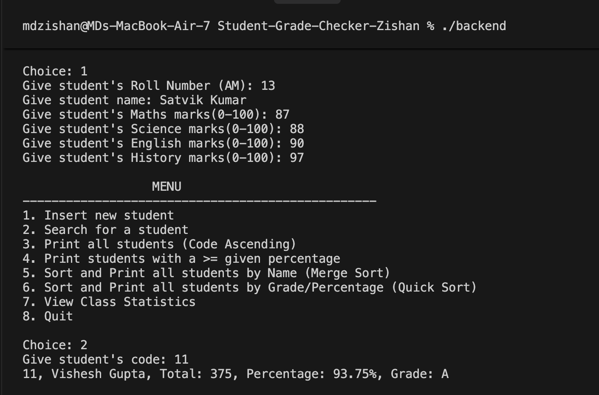
  <br/>
  <b>Choice 2: Search for a student</b><br/>
  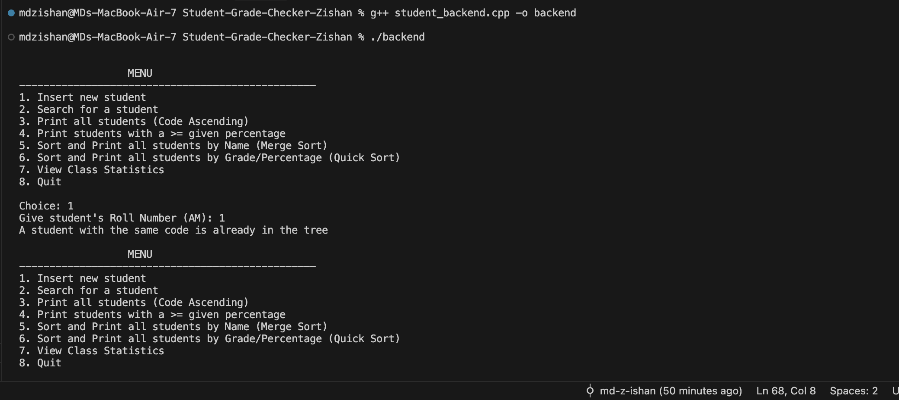
  <br/>
  <b>Choice 3: Print all students (Code Ascending)</b><br/>
  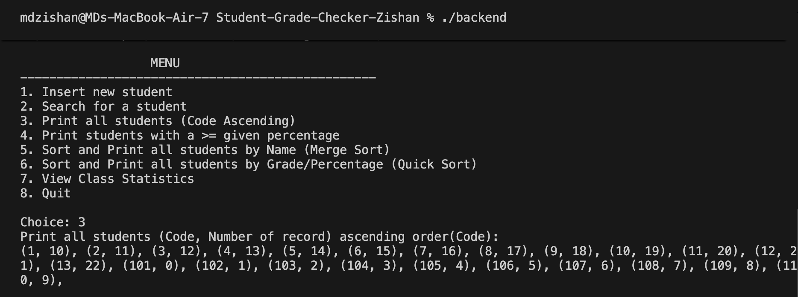
  <br/>
  <b>Choice 4: Print students with a >= given percentage</b><br/>
  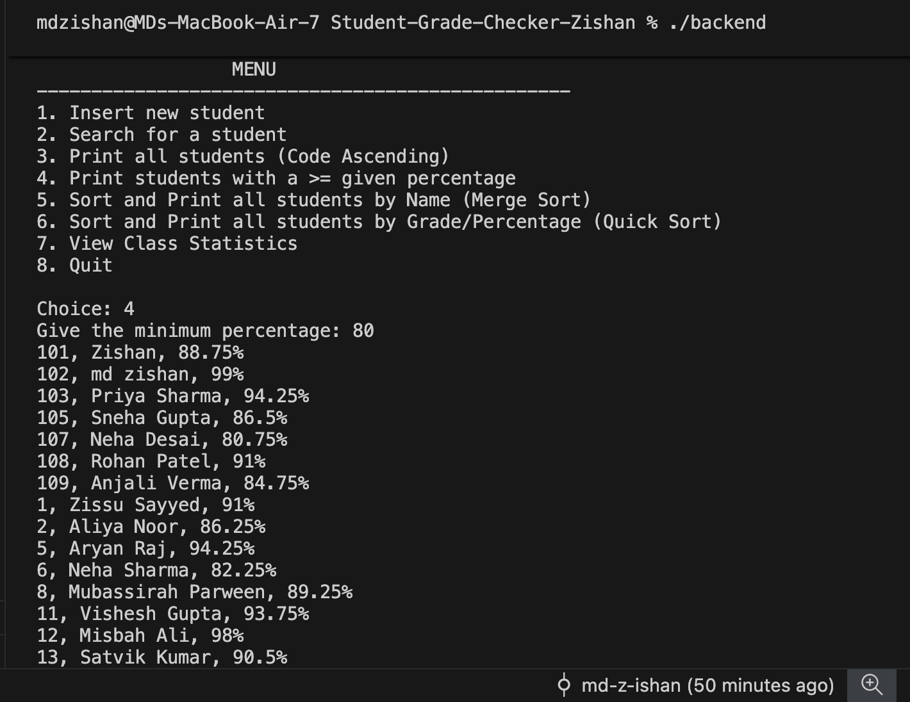
  <br/>
  <b>Choice 5: Sort and Print all students by Name</b><br/>
  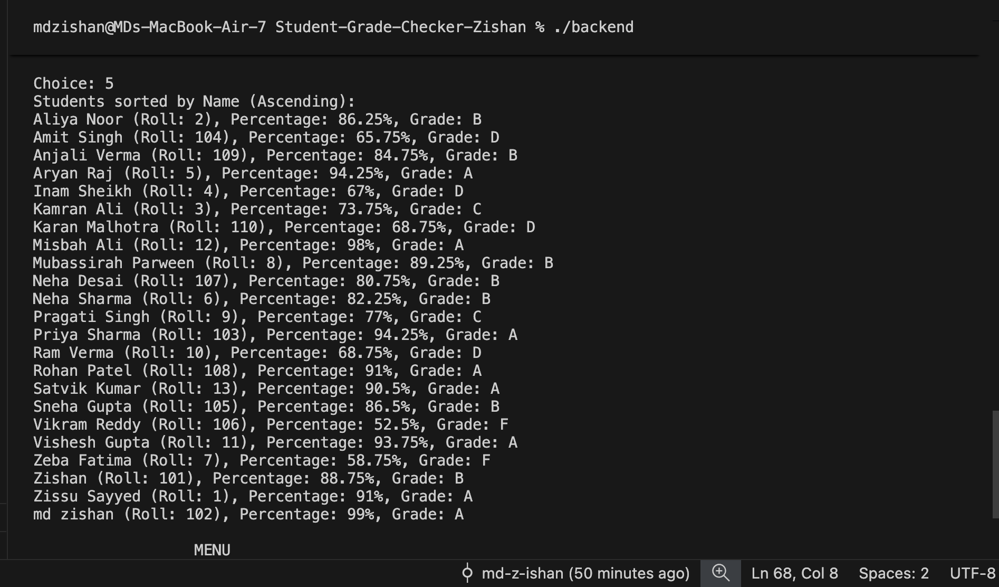
  <br/>
  <b>Choice 6: Sort and Print all students by Grade/Percentage</b><br/>
  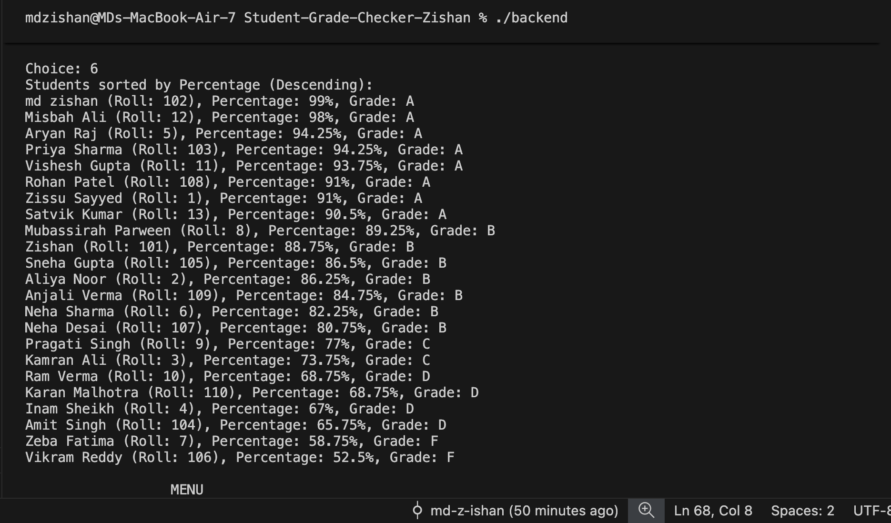
  <br/>
  <b>Choice 7 & 8: View Class Statistics & Quit</b><br/>
  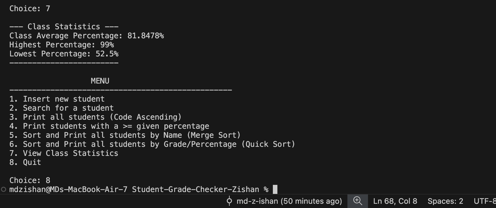
</div>
